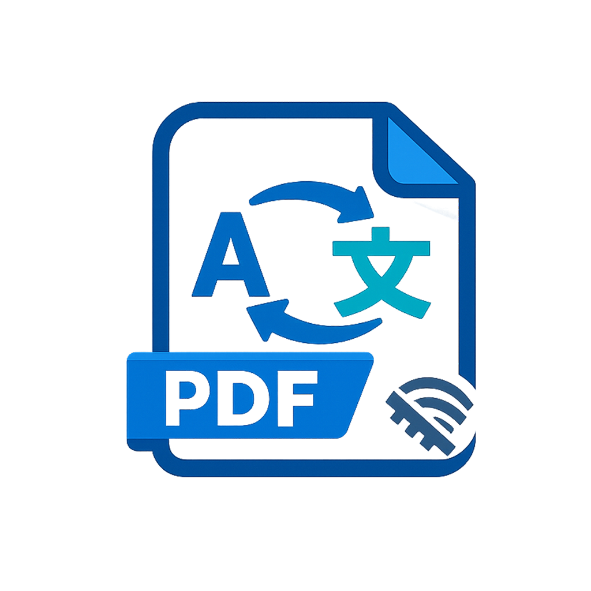

<p align="center">
  
</p>

<h1 align="center">Offline PDF Translator</h1>

<p align="center">
  A native macOS app that translates PDF documents fully offline after a one-time model download.<br>
  Open source · privacy-friendly · no cloud translation API
</p>

<p align="center">
  <a href="#features">Features</a> ·
  <a href="#requirements">Requirements</a> ·
  <a href="#build-from-source">Build</a> ·
  <a href="#usage">Usage</a> ·
  <a href="#supported-languages">Languages</a> ·
  <a href="#architecture">Architecture</a> ·
  <a href="#contributing">Contributing</a> ·
  <a href="#license">License</a>
</p>

---

## Features

- **Offline translation** — once a language-pair model is downloaded, all translation runs locally on your Mac
- **Side-by-side preview** — original and translated pages with synced scrolling
- **Layout-aware rewrite** — replaces text in place with PyMuPDF while preserving vector elements where possible
- **On-demand models** — ~150 MB per language pair, downloaded only when first used
- **Bundled runtime** — ships a standalone Python + CTranslate2 + SentencePiece stack (models are not bundled)

## Requirements

| | |
| --- | --- |
| macOS | 14+ recommended (see Xcode deployment target in the project) |
| Hardware | Apple Silicon or Intel |
| Xcode | 16+ to build from source |
| Network | Once to fetch the Python runtime when running the build script; once per language pair on first translate |

## Build from source

```bash
git clone https://github.com/cricel/offline-pdf-translator.git
cd offline-pdf-translator

# Download standalone Python and install translation dependencies
# (does not download MT models)
chmod +x Tools/build_translator_runtime.sh
./Tools/build_translator_runtime.sh

# Open in Xcode
open offline-pdf-translator.xcodeproj
```

In Xcode:

1. Select the **offline-pdf-translator** scheme
2. Choose **My Mac**
3. Press **Run** (⌘R)

The Xcode target includes a **Copy Translator Runtime** build phase that embeds `TranslatorRuntime/` into the app bundle. If that folder is missing Python or `ct2_bridge.py`, the build fails with instructions to run the script above.

### Rebuild the runtime later

```bash
./Tools/build_translator_runtime.sh
```

Then rebuild the app in Xcode so the updated runtime is copied into the `.app`.

## Usage

1. **Open PDF** — choose a text-based PDF (scanned/image-only PDFs have no text layer to translate)
2. Pick **From → To** — targets marked with **↓** still need a one-time model download
3. Click **Translate** (⌘↩) — the model downloads if needed, then pages update on the right
4. **Save Translated PDF** — export the result

Downloaded models are stored at:

```text
~/Library/Application Support/offline-pdf-translator/models/
```

## Supported languages

Pairs are defined in [`TranslatorRuntime/model_catalog.json`](TranslatorRuntime/model_catalog.json) (Hugging Face CTranslate2 Opus-MT packs), including:

| Direction | Examples |
| --- | --- |
| English ↔ | Chinese, Spanish, French, German, Italian, Russian |
| → English | Japanese, Korean |

To add a pair, append an entry to the catalog. The Hugging Face repo must expose:

- `model.bin`
- `config.json`
- `source.spm` or `sentencepiece.model`
- `shared_vocabulary.json`
- optional `target.spm`

## Architecture

| Layer | Role |
| --- | --- |
| SwiftUI + PDFKit | UI, side-by-side preview, import/export |
| `OfflineTranslationService` | Launches bundled `python3`, downloads models on demand |
| `ct2_bridge.py` | Catalog + download + CTranslate2 translate + PyMuPDF page rewrite |

```text
offline-pdf-translator/          SwiftUI macOS app
offline-pdf-translator.xcodeproj
TranslatorRuntime/
  ct2_bridge.py                  Offline bridge (checked in)
  model_catalog.json             Downloadable language pairs (checked in)
  python/                        Standalone CPython (generated, gitignored)
Tools/
  build_translator_runtime.sh    Fetches Python + pip packages
```

## App Store

This project is intended for Mac App Store distribution while remaining open source. The App Store binary may include the bundled runtime; translation models continue to download on first use per language pair.

When preparing a release archive in Xcode: **Product → Archive**, then distribute via Organizer / App Store Connect.

## Contributing

Issues and pull requests are welcome.

1. Fork the repository and create a feature branch
2. Run `./Tools/build_translator_runtime.sh` before building in Xcode
3. Keep changes focused; update `model_catalog.json` when adding language pairs
4. Open a pull request with a short description of the change and how you tested it

## Privacy

- Translation runs on-device after models are installed
- Network is used only to download the developer runtime (build time) and language models (first use of a pair)
- No cloud translation API and no account required

## License

This project is released under the [MIT License](LICENSE).

Third-party components (CTranslate2, SentencePiece, PyMuPDF, Opus-MT models, and the standalone Python build) remain under their respective licenses. Model weights are downloaded from Hugging Face at runtime and are not redistributed by this repository.
